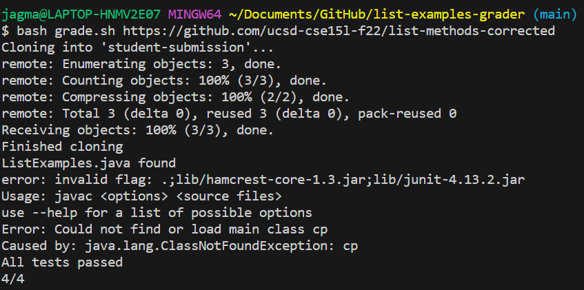
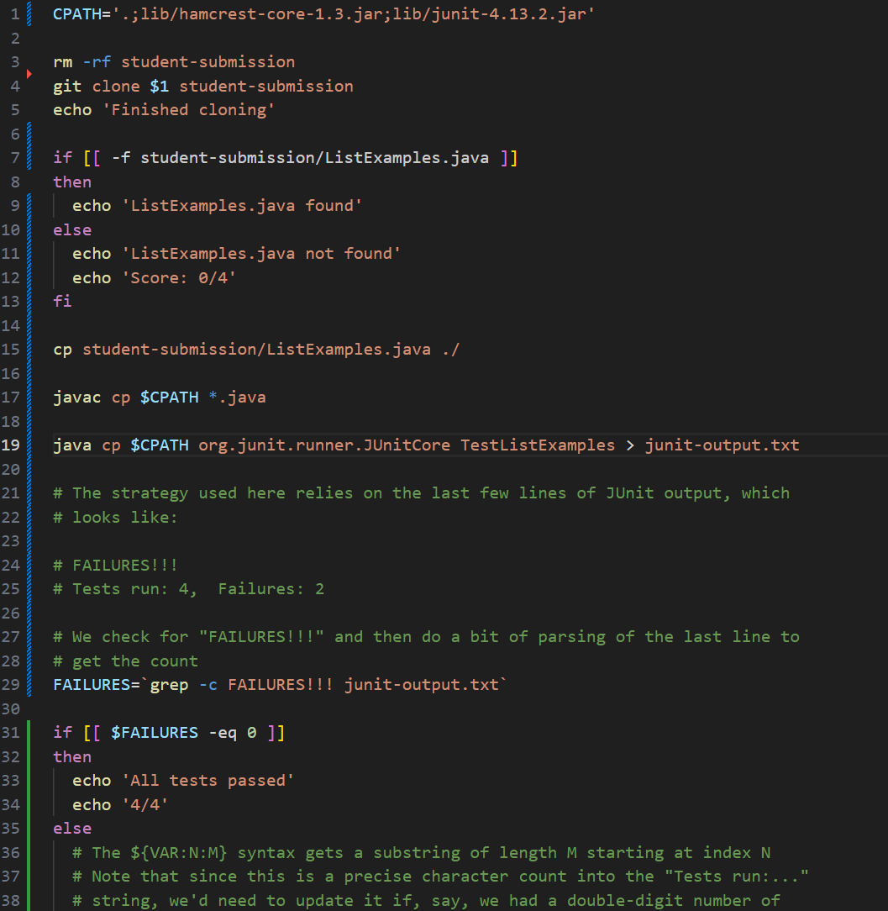
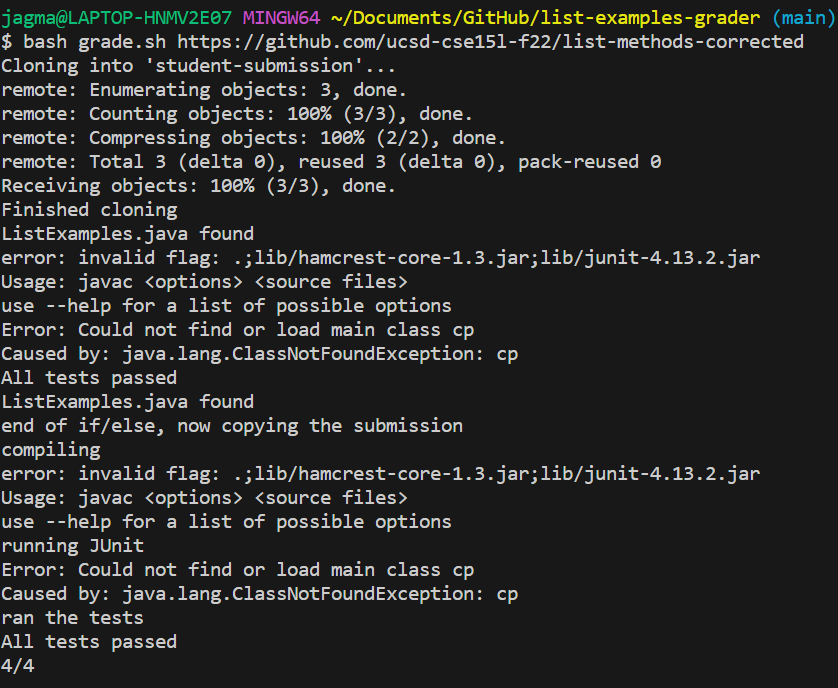
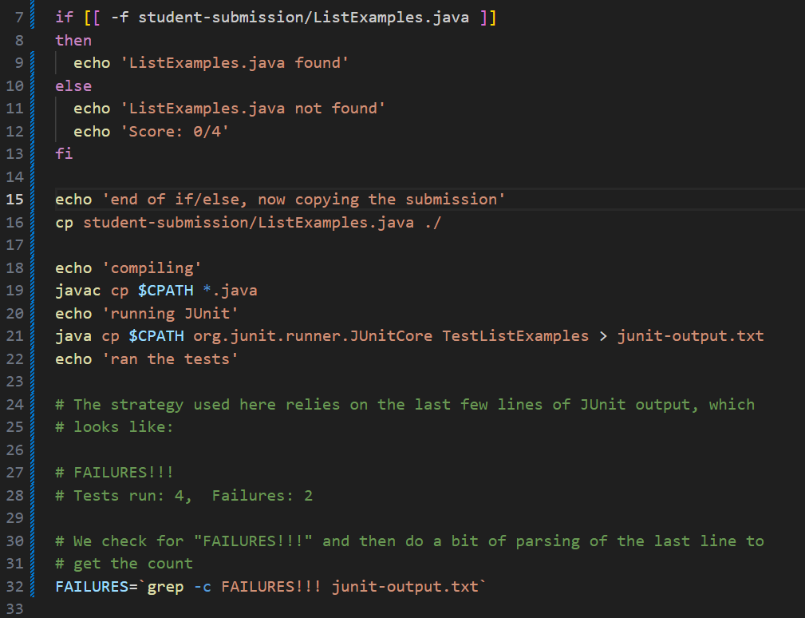
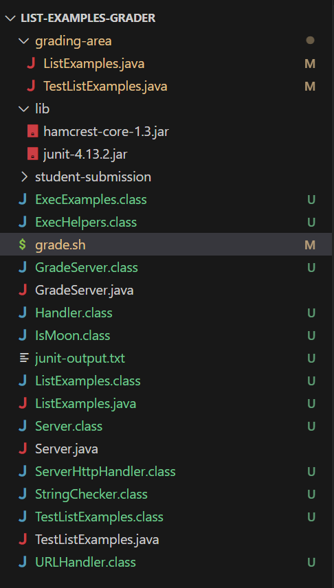
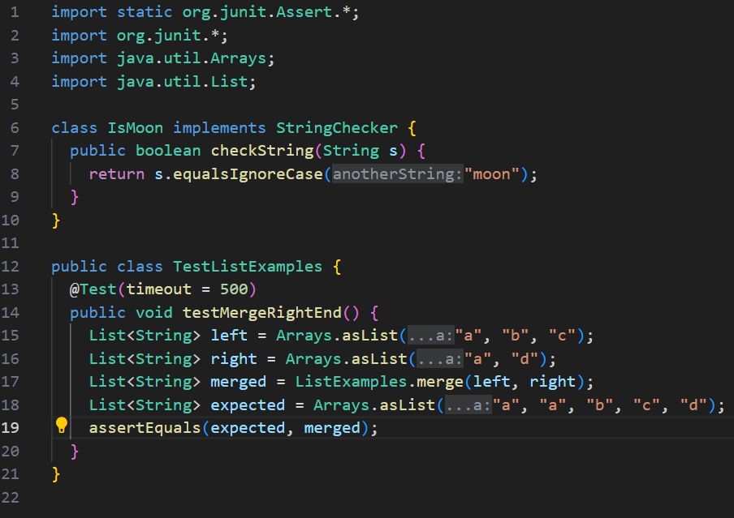
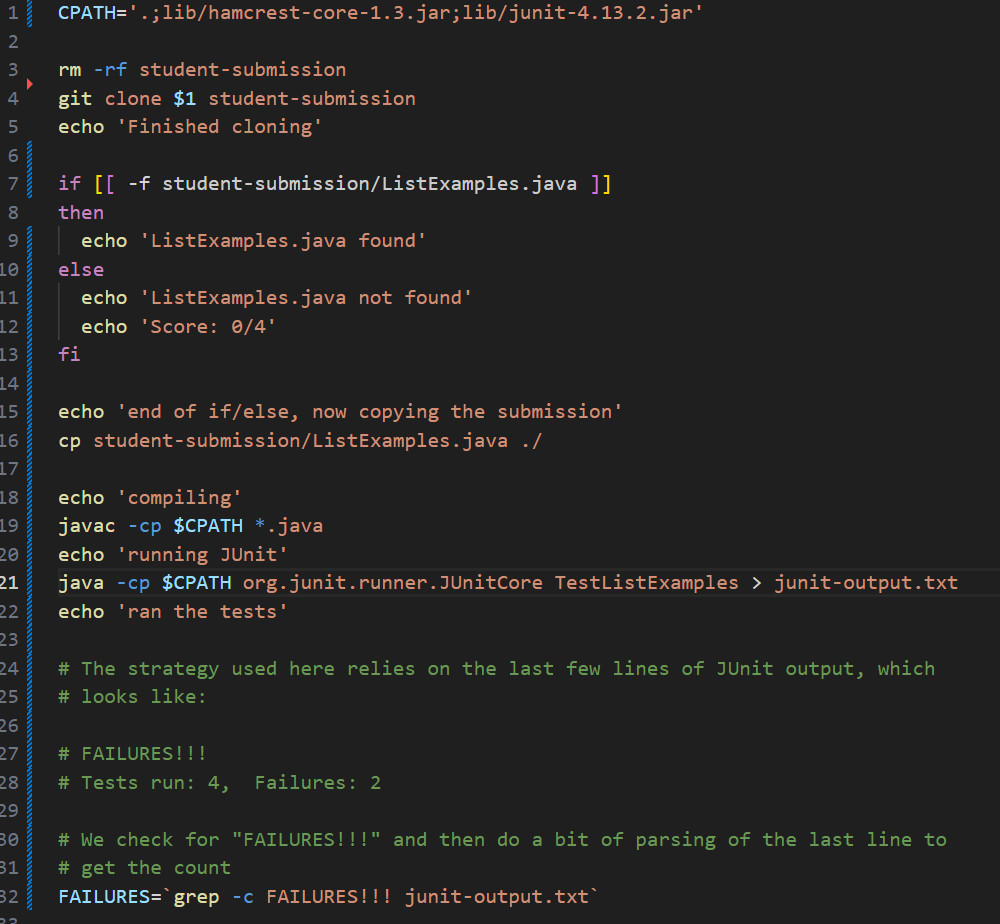

# Lab Report 5: Part 1
This lab report includes creating a debugging scenario I have to simulate a bug and working with a TA to test what is causing the big and then eventually fixing it. 

# The Symptom 
Included in this section is an example of a symptom produced by a bug in a code and a student asking on EdStem how to work through the issue. The example EdStem post will be following the template that is given on the website when trying to make a post to make it as realistic as possible. This code is not my own but actually the ListExamplesGrader repository from one of the previous labs. I just changed some of the code to produce an error. For simplicity's sake I'm going to take the position that it is my code since it's just an example. Taking the postition of the student, the EdStem post would look something like the following:

I'm using VSCode on my laptop and I'm running a scipt called grade.sh using bash. 

The image below depcits the symptom I'm experiencing. The issue comes from the output line after `ListExamples.java found'. The line after should be `All tests passed` and then `4/4`. Instead, I'm getting several error messages that I'm not very familiar with. It seems that there could be an issue within multiple lines of my code. 

The program is supposed to take in a student submission for a coding assignment and then evaluate the correctness of their code. This is done by running a bash script of grade.sh which checks for the correctness and then outputs the score the student receives. I've included the code in an image down below so you can see what I've done so far. The code is supposed to check that the student's submission actually exists and then it clones correctly. Then the program is supposed to run the JUnit Tests I've created to make sure the code works correctly. At some point in that process I'm getting an error. I'm assuming that I used one of the commands in the script incorrectly between line 7-19 as that is where the error is shwoing up. 

# TA Response
This section includes taking the stance of the TA as they respond to my post. Their response would look something like:

I agree that your symptom is coming from those lines of code. I recommend including more echo statements within your script that can give you information on which part of the code is giving you the error. If that doesn't help, I would notice the colors that VSCode uses to differentiate the kinds of keywords and phrases in the script. I'm noticing a discrepancy within some of your lines meaning you are likely using the wrong command or are using it incorrectly. I would specifically use line 29 as a comparison to understand what I'm referencing. 

# Fixing the Bug
This section includes the student's debugging method and how they figured out what the issue was. There are images below the description of the new terminal output and the updated code.

The student ended up adding echo statements on line 15, 18, 20, and 22 to get additional output that helps to narrow down where the issues are. These echo statements simply state what has just happened in the code and/or what the code should be doing next. We can see from the images of the terminal and code below that there is an error after `echo "compiling"` and `echo "running JUnit"`.Therefore, these echo statements helped to narrow down the errors to both lines 19 and 21. Utilizing the information the student got from the TA about the different uses of colors in VSCode and to look at line line 29 (now line 32), the student now realizes that -c is colored blue in line 32. In lines 19 and 21, the student uses cp wanting to use class path which should be colored blue but it is actually orange. The student then realizes he was using the command to copy the files instead of running class path. 

# Summary of Findings
This section includes how I created this example, how it runs, and how it should be fixed.

Firstly, below is the file and directory structure that is used for this example. However, I was using a repository created by the professor/TAs and I was only using a section of it. So the only files that are actually important in the screenshot are grade.sh, ListExamples.java, and TestListExamples.java.  

Below is the code before the bug is fixed. The only file I actually edited is grade.sh but I included ListExamples.java and TestListExamples.java (in order) so you can see what the code is running. 

Below is the command I ran to trigger the bug and the output.

To fix the bug you simply change cp to -cp on lines 19 and 21 as seen in the image below.

# Lab Report 5: Part 2
Something I learned from my lab experience is running commands can be done in a variety of ways. You can run commands from the terminal, in a script, and even in java. I had no idea that there were so many ways to run a command which also makes coding far more versatile than I realized. During the labs, whenever I consulted one of my lab group members, they always had a different way to approach the problem. Some people would fix an error using vim, others would simply go into the code and change the error there, some would just use the script to analyze their mistakes. I thought it was really cool that each person could use a different approach to get to the same end result and it involved doing it in their own way.
